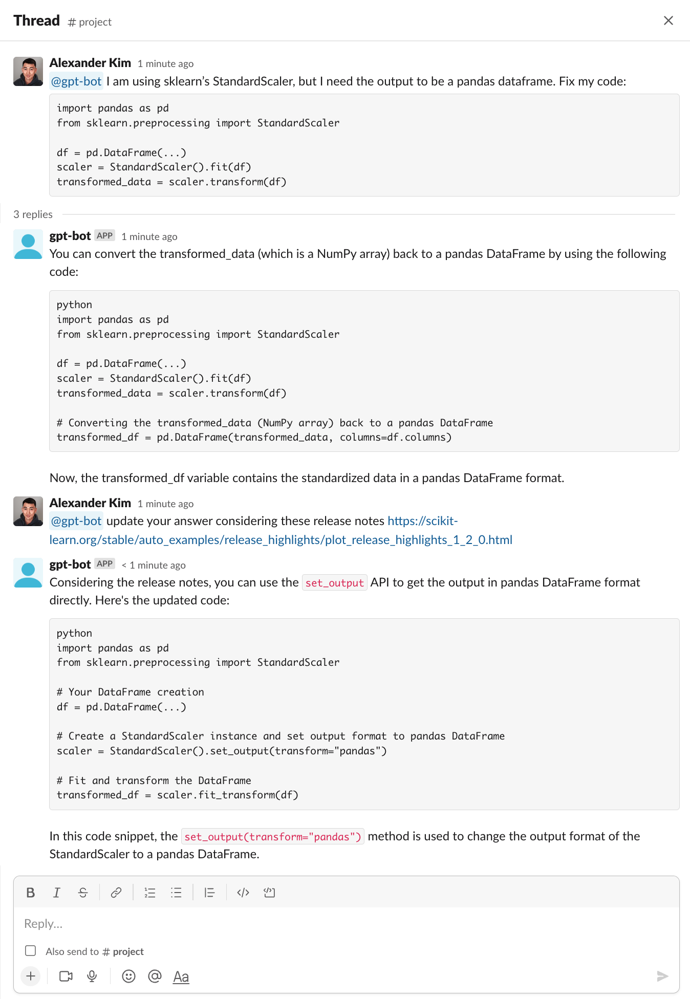

# CipherHealth Internal Slack GPT Bot
This repo was forked from https://github.com/alex000kim/slack-gpt-bot and contains a Python-based Slack GPT Bot that uses OpenAI's GPT model to answer users' questions. Additionally, the bot can extract content from URLs provided in the user's message and take into account their content in its response.

## Changes specific to Cipher
Additional logging components have been added for compliance purposes to track all user info across inputs & outputs.
## Features
- Extract URLs from user messages
- Scrape webpage content from URLs
- Integrate with OpenAI's GPT-4 to answer questions
- Maintain conversation context in a threaded format
- Socket mode integration with SlackA
- Logs all inputs, outputs, user names, and emails to structured json payload which is compatible with GCP Logging
## Dependencies
- Python 3.6 or later
- beautifulsoup4
- slack-bolt
- slack-sdk
- openai
- requests
- json-logger-stdout
- python-dotenv

See `requirements.txt`.

# Installation
## Building the bot 
Build the container (generic)
```
docker build . -t slack-gpt-bot
```
Tag it for the GCR (Generic example)
```
docker tag slack-gpt-bot us.gcr.io/PROJECT_ID/slack-gpt-bot:TAG
```
Push to the GCR (Generic example)
```
docker push us.gcr.io/PROJECT_ID/slack-gpt-bot:TAG
``` 
***Beta Specifics***

```
docker build . -t slack-gpt-bot
docker tag slack-gpt-bot us.gcr.io/qaload-track-atlas-ch-e4e9/slack-gpt-bot:latest
docker push us.gcr.io/qaload-track-atlas-ch-e4e9/slack-gpt-bot:latest
```
## Deploying the bot
The bot leverages sockets which do not play nice with CloudRun, as such it is to be deployed as a container to GCE directly.

Deploy the container to a GCE compute instance https://cloud.google.com/compute/docs/containers/deploying-containers#gcloud_1

Mandatory environment variables are:

```bash
SLACK_BOT_TOKEN=your_slack_bot_token
SLACK_APP_TOKEN=your_slack_app_token
OPENAI_API_KEY=your_openai_api_key
```
These must be configured in Slack and you must have an OpenAI key. 

***Beta Specifics***

For now, this bot is just for beta testing and should be deployed the following way.  This replaces an existing GCP instance
running managed container OS with the latest tag.  It will stop the instance, pull the new image and start.
```
gcloud compute instances update-container slack-gpt-bot-vm --container-image us.gcr.io/qaload-track-atlas-ch-e4e9/slack-gpt-bot:latest
```


## Configuring Permissions in Slack
Before you can run the Slack GPT Bot, you need to configure the appropriate permissions for your Slack bot. Follow these steps to set up the necessary permissions:

1. Create [Slack App](https://api.slack.com/authentication/basics)
2. Go to your [Slack API Dashboard](https://api.slack.com/apps) and click on the app you created for this bot.
3. In the left sidebar, click on "OAuth & Permissions".
4. In the "Scopes" section, you will find two types of scopes: "Bot Token Scopes" and "User Token Scopes". Add the following scopes under "Bot Token Scopes":
   - `app_mentions:read`: Allows the bot to read mention events.
   - `chat:write`: Allows the bot to send messages.
5. Scroll up to the "OAuth Tokens for Your Workspace" and click "Install App To Workspace" button. This will generate the `SLACK_BOT_TOKEN`.
6. In the left sidebar, click on "Socket Mode" and enable it. You'll be prompted to "Generate an app-level token to enable Socket Mode". Generate a token named `SLACK_APP_TOKEN` and add the `connections:write` scope.
7. In the "Features affected" section of "Socket Mode" page, click "Event Subscriptions" and toggle "Enable Events" to "On". Add `app_mention` event with the `app_mentions:read` scope in the "Subscribe to bot events" section below the toggle.

## Usage
1. Start the bot:

```
python slack_gpt_bot.py
```
2. Invite the bot to your desired Slack channel.
3. Mention the bot in a message and ask a question (including any URLs). The bot will respond with an answer, taking into account any extracted content from URLs.

## Example
Note: The cutoff date of GPT-4 knowledge is Sep 2021, bit scikit-learn v1.2 was released in Dec 2022


## Troubleshooting
If you have issues pushing the image to the GCR, its likely a permission issue, you can try re-authenticating with GCP
and fixing the docker config like so:
```
gcloud auth login
gcloud config set project qaload-track-atlas-ch-e4e9
gcloud auth configure-docker
```

